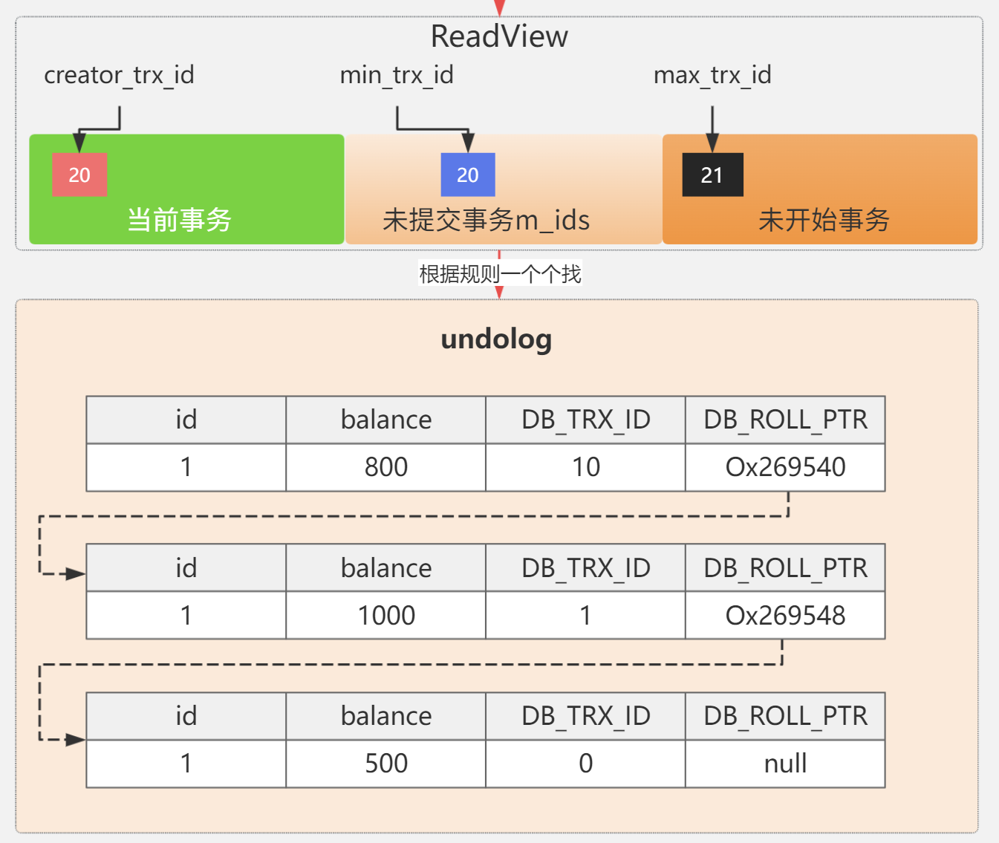

# 前置知识

## 按锁的粒度分类

- **记录锁（Record Lock）**：属于单个行记录上的锁。

- **间隙锁（Gap Lock）**：锁定一个范围，不包括记录本身，间隙锁之间不冲突，不分排他和共享。

- **临键锁（Next-Key Lock）**：Record Lock+Gap Lock，锁定一个范围，包含记录本身，主要目的是为了解决幻读问题（MySQL 事务部分提到过）。记录锁只能锁住已经存在的记录，为了避免插入新记录，需要依赖间隙锁，左开右闭。

  在 InnoDB 默认的隔离级别 REPEATABLE-READ 下，行锁默认使用的是 Next-Key Lock。但是，如果操作的索引是唯一索引或主键，InnoDB 会对 Next-Key Lock 进行优化，将其降级为 Record Lock，即仅锁住索引本身，而不是范围。

- **表级锁**：锁定整张表。

这里只提一点，行级锁锁住的是索引字段，而表级锁才是在物理存储上锁住了表，没有命中唯一索引或者索引失效的话，就会导致扫描全表对表中的所有行记录进行加锁。不过，很多时候即使用了索引也有可能会走全表扫描，这是因为 MySQL 优化器的原因，一些情况下全表扫描更快，比如**索引碎片化严重**。

## 意向锁

**意向共享锁（Intention Shared Lock，IS 锁）**：事务有意向对表中的某些记录加共享锁（S 锁），加共享锁前必须先取得该表的 IS 锁。

**意向排他锁（Intention Exclusive Lock，IX 锁）**：事务有意向对表中的某些记录加排他锁（X 锁），加排他锁之前必须先取得该表的 IX 锁。

**意向锁是由数据引擎自己维护的，用户无法手动操作意向锁，在为数据行加共享/排他锁之前，InnoDB 会先获取该数据行所在在数据表的对应意向锁。**

意向锁之间是互相兼容的。

|       | IS 锁 | IX 锁 |
| ----- | ----- | ----- |
| IS 锁 | 兼容  | 兼容  |
| IX 锁 | 兼容  | 兼容  |

意向锁和共享锁和排它锁互斥（这里指的是表级别的共享锁和排他锁，意向锁不会与行级的共享锁和排他锁互斥）。

|      | IS 锁 | IX 锁 |
| ---- | ----- | ----- |
| S 锁 | 兼容  | 互斥  |
| X 锁 | 互斥  | 互斥  |

### 协调表级锁和行级锁的操作

在数据库中，存在表级锁和行级锁两种不同粒度的锁。当一个事务想要对表加表级锁时，需要知道表中是否有行已经被其他事务加了行级锁；反之，当一个事务想要对行加行级锁时，也需要知道表是否已经被其他事务加了表级锁。意向锁的引入就是为了协调这两种不同粒度锁之间的操作。

- **示例**：假设事务 A 想要对表 `employees` 中的某一行加行级排他锁。在加锁之前，InnoDB 会先在表级别上加一个意向排他锁（IX 锁），表示事务 A 意图在表中的某些行上加排他锁。如果此时另一个事务 B 想要对整个 `employees` 表加表级排他锁，它会检查到表上已经有了意向排他锁，就知道表中可能有行已经被加了行级锁，从而避免直接加表级锁导致的冲突。

### 提高加锁效率

如果没有意向锁，当一个事务要对表加表级锁时，需要遍历表中的每一行，检查是否有行被加了行级锁，这会带来很大的开销。而意向锁的存在可以让事务快速判断表中是否有行被加了锁。

- **示例**：事务 C 要对 `orders` 表加表级共享锁（S 锁），如果表上没有意向排他锁（IX 锁），事务 C 可以直接加表级共享锁，无需逐行检查。因为意向排他锁表示有事务意图在表中的行上加排他锁，若没有该意向锁，就说明当前不太可能存在行级排他锁，从而提高了加锁的效率。

### 避免死锁

意向锁可以帮助数据库提前检测到潜在的锁冲突，从而避免死锁的发生。当一个事务请求的锁与当前表上的意向锁不兼容时，数据库可以及时拒绝该请求，避免事务进入等待状态，进而减少死锁的可能性。

- **示例**：事务 D 想要对 `products` 表加表级排他锁，而此时表上已经有了意向共享锁（IS 锁），这表明有其他事务可能已经在表中的某些行上加了行级共享锁。数据库检测到这种不兼容性后，会拒绝事务 D 的请求，避免事务 D 等待行级锁释放而与其他事务形成死锁。

### 保证事务隔离性

意向锁有助于维护不同事务之间的隔离性。通过明确表示事务对表和行的锁定意图，不同事务可以根据这些信息来决定是否可以安全地访问数据，从而保证了事务的隔离级别。

- **示例**：在可重复读隔离级别下，事务 E 对 `customers` 表中的某些行加了行级排他锁，并在表级别上加了意向排他锁。其他事务在看到表上的意向排他锁后，会根据自身的隔离级别和操作需求，决定是否等待或者放弃对该表的操作，从而保证了事务之间的数据隔离。

## 自增锁

自增锁有以下三种模式：

- 传统模式：使用表级锁，确保只有一个事务在插入数据。
- 连续模式：如果可以确定插入的数据数量，就可以提前将这部分的自增ID留出来，在自增时使用mutex互斥锁保证生成的ID不重复，例如insert 10条数据，如今ID为10，就会把10~19这10条ID预留出来，其他事务从20开始自增；如果不确定插入的数据数量，则只能加表锁，退化为传统模式。
- 无锁模式：只对自增ID的过程加上mutex轻量级锁，其他过程一概不管，会造成多个事务的insert语句交替执行，导致一个事务内的多条连续插入数据ID不连续，**这种模式与Binlog的statement模式冲突，因为相同的statement，在主从服务器插入的ID顺序是不一样的，如果采用statement模式，必须使用连续模式或者传统模式。**

分别对应配置项 `innodb_autoinc_lock_mode` 的值0、1、2.

## 元数据锁

再来说说**元数据锁**（MDL）。

我们不需要显示的使用 MDL，因为当我们对数据库表进行操作时，会自动给这个表加上 MDL：

- 对一张表进行 CRUD 操作时，加的是 **MDL 读锁**；
- 对一张表做结构变更操作的时候，加的是 **MDL 写锁**；

MDL 是为了保证当用户对表执行 CRUD 操作时，防止其他线程对这个表结构做了变更。

当有线程在执行 select 语句（ 加 MDL 读锁）的期间，如果有其他线程要更改该表的结构（ 申请 MDL 写锁），那么将会被阻塞，直到执行完 select 语句（ 释放 MDL 读锁）。

反之，当有线程对表结构进行变更（ 加 MDL 写锁）的期间，如果有其他线程执行了 CRUD 操作（ 申请 MDL 读锁），那么就会被阻塞，直到表结构变更完成（ 释放 MDL 写锁）。

> MDL 不需要显示调用，那它是在什么时候释放的?

MDL 是在事务提交后才会释放，这意味着**事务执行期间，MDL 是一直持有的**。

那如果数据库有一个长事务（所谓的长事务，就是开启了事务，但是一直还没提交），那在对表结构做变更操作的时候，可能会发生意想不到的事情，比如下面这个顺序的场景：

1. 首先，线程 A 先启用了事务（但是一直不提交），然后执行一条 select 语句，此时就先对该表加上 MDL 读锁；
2. 然后，线程 B 也执行了同样的 select 语句，此时并不会阻塞，因为「读读」并不冲突；
3. 接着，线程 C 修改了表字段，此时由于线程 A 的事务并没有提交，也就是 MDL 读锁还在占用着，这时线程 C 就无法申请到 MDL 写锁，就会被阻塞，

那么在线程 C 阻塞后，后续有对该表的 select 语句，就都会被阻塞，如果此时有大量该表的 select 语句的请求到来，就会有大量的线程被阻塞住，这时数据库的线程很快就会爆满了。

> 为什么线程 C 因为申请不到 MDL 写锁，而导致后续的申请读锁的查询操作也会被阻塞？

这是因为申请 MDL 锁的操作会形成一个队列，队列中**写锁获取优先级高于读锁**，一旦出现 MDL 写锁等待，会阻塞后续该表的所有 CRUD 操作。

所以为了能安全的对表结构进行变更，在对表结构变更前，先要看看数据库中的长事务，是否有事务已经对表加上了 MDL 读锁，如果可以考虑 kill 掉这个长事务，然后再做表结构的变更。

# 事务隔离级别

| 隔离级别              | 解决的问题                                                                 | 未解决的问题/副作用                                      | 典型应用场景                     |
|-----------------------|--------------------------------------------------------------------------|--------------------------------------------------------|---------------------------------|
| **读未提交** (Read Uncommitted) | - 无明确解决的问题 - 允许读取其他未提交事务的修改（最低隔离性）             | - 脏读（Dirty Read） - 不可重复读（Non-Repeatable Read） - 幻读（Phantom Read） | 对数据一致性要求极低，追求最高并发性能的场景 |
| **读已提交** (Read Committed)   | - 解决**脏读** （只能读取已提交的数据）                                   | - 不可重复读 - 幻读                                   | 多数 OLTP 系统的默认级别（如 Oracle）       |
| **可重复读** (Repeatable Read)  | - 解决**脏读**和**不可重复读** （事务期间多次读取同一数据结果一致）        | - 幻读（标准 SQL 定义允许，但 MySQL 通过 MVCC 规避）      | 需要保证事务内数据稳定的场景（如 MySQL 默认级别） |
| **串行化** (Serializable)      | - 解决**脏读**、**不可重复读**和**幻读** （通过完全锁表实现最高隔离性）    | - 并发性能极低 - 可能引发死锁                          | 对数据一致性要求极高，可接受低并发的场景      |

在 **读已提交（Read Committed）** 和 **可重复读（Repeatable Read）** 隔离级别下，行级锁的行为因具体数据库实现（如 MySQL、PostgreSQL）和是否使用 MVCC（多版本并发控制）而有所不同，但核心逻辑如下：

---

## **1. 读已提交（Read Committed）**
**锁机制**：

- **写操作（UPDATE/DELETE）**：对修改的行加**排他锁（X 锁）**，其他事务无法修改或加排他锁，但允许读取（取决于是否用 MVCC）。
- **读操作（SELECT）**：  
  - **无锁**：若数据库使用 MVCC（如 PostgreSQL），读操作直接读取已提交的快照，不加锁。
  - **共享锁（S 锁）**：若数据库不加 MVCC（如旧版本 SQL Server），读操作会对行加共享锁，但共享锁在语句执行后立即释放。

**并发行为**：

- **写阻塞写**：事务 A 对行加排他锁后，事务 B 的写操作会被阻塞，直到锁释放。
- **读不阻塞读**：共享锁允许多个事务同时读取同一行。
- **读可能读到最新提交**：MVCC 下读操作不会阻塞写，但可能读到其他事务已提交的新数据。

---

## **2. 可重复读（Repeatable Read）**
**锁机制**：

- **写操作（UPDATE/DELETE）**：对修改的行加**排他锁（X 锁）**，直到事务结束。
- **读操作（SELECT）**：  
  - **快照读（MVCC 实现）**：如 MySQL InnoDB，通过版本快照实现可重复读，不加锁。
  - **当前读（临键 S 锁）**：若数据库强制加锁（如某些场景下的 `SELECT ... FOR SHARE/UPDATE`），共享锁会持续到事务结束，临键锁可以用来解决幻读问题。

**并发行为**：

- **写阻塞写**：排他锁会阻塞其他事务的写操作。
- **读不阻塞读**：MVCC 下读操作无锁，直接读取快照；若强制加共享锁，共享锁允许多个事务同时读。
- **避免幻读**：通过范围锁（如 MySQL 的间隙锁）或 MVCC 快照保证事务内多次读取结果一致。

## 3. 串行化（Serializable）

**锁机制**

- **写操作（UPDATE/DELETE/INSERT）**： 
  - 会对涉及的数据（如表、行或索引范围）加 **排他锁（X锁，Exclusive Lock）**，不仅锁住数据行，还用间隙锁锁住了间隙，阻止其他事务读取或修改这些数据。
  - 如果操作涉及全表扫描（例如无索引的更新），可能会直接加 **表级排他锁**。

- **读操作（SELECT）**：  
  - 会对涉及的数据加 **共享锁（S锁，Shared Lock）**，允许其他事务读取同一数据，但阻止其他事务加排他锁（X锁）进行修改。
  - 如果查询涉及全表扫描（例如无索引的 `SELECT *`），为了防止幻读（Phantom Read），可能会加 **表级共享锁** 或 **范围锁（Range Lock）**，从而阻止其他事务插入、删除或修改相关数据

**并发行为**

1. **写阻塞一切**： 
   表级锁阻塞其他一切操作。
2. **读可能阻塞写**： 
   若读操作显式加锁（如 `SELECT ... FOR SHARE`），会阻止其他事务对该行加排他锁。
3. **全隔离性**：
   通过锁或事务序列化彻底避免脏读、不可重复读和幻读，但并发性能显著下降。

## 补充说明

### 问题定义

| 问题名称               | 描述                                                                 |
|------------------------|--------------------------------------------------------------------|
| **脏读**               | 读取到其他事务未提交的修改（若事务回滚则数据无效）                      |
| **不可重复读**          | 同一事务内多次读取同一行数据，结果不一致（因其他事务提交了修改）          |
| **幻读**               | 同一事务内多次查询同一范围数据，结果集行数变化（因其他事务提交了新增/删除） |

### 结论

| 特性                  | 读未提交 | 读已提交 | 可重复读 | 串行化  |
|:---------------------:|---------|---------|---------|--------|
| **并发性能**           | 最高     | 高       | 中       | 最低    |
| **数据一致性**         | 最低     | 中等     | 高       | 最高    |
| **锁粒度**             | 无锁    | 行级锁 | 行级锁   | 表级锁  |

### 行锁升级为表锁的情况

| 情况             | 描述                                                         | 原因                                                |
| ---------------- | ------------------------------------------------------------ | --------------------------------------------------- |
| 未使用索引       | UPDATE 语句的 WHERE 子句中没有使用索引，导致全表扫描         | name 列上没有索引，导致全表扫描                     |
| 类型转换         | WHERE 子句中的条件涉及到数据类型转换，MySQL 无法使用索引     | name 列的数据类型是 VARCHAR，查询条件使用了数字类型 |
| 索引选择         | 即使 WHERE 子句中使用了索引，MySQL 的查询优化器也可能选择不使用索引，而是进行全表扫描 | age 列上有索引，但匹配了表中大部分行                |
| 并发更新大量数据 | 当 UPDATE 语句影响表中大部分数据（通常是超过 80% 的数据）时，MySQL 可能会选择使用表锁 | 影响了表中大部分行                                  |
| DDL 操作         | 在执行数据定义语言（DDL）操作时，如 ALTER TABLE 、TRUNCATE TABLE 等，MySQL 会自动对表进行锁定 | DDL 操作需要确保操作的一致性和完整性                |
| 手动锁定表       | 使用 LOCK TABLES 语句手动锁定表时，MySQL 会直接对整个表进行锁定 | LOCK TABLES 语句直接对表进行写锁定                  |
| 意向锁           | 在某些情况下，即使 UPDATE 语句使用了索引，InnoDB 也可能因为意向锁（Intention Locks）的存在而升级行锁为表锁 | 事务中的 SELECT ... FOR UPDATE 语句可能影响大量行   |

# MVCC

读未提交和串行化比较极端，一个是什么也不管，放任各个事务执行，一个是强制只能一个事务读和写，在串行化的隔离级别下，上的都是表锁，读数据的时候上共享锁，写数据的时候上排他锁，支持多个事务同时读数据，不支持读写并发和写写并发。

以上两种方式方案很简单，而RC和RR是比较复杂的，如果只靠锁实现这两种隔离级别，实现方案如下：

读的时候给数据加上行级共享锁，写的时候加上行级排他锁，可以看出和串行化的区别就是锁的粒度从表级缩小到了行级，但是缺点就是读的时候没办法写，写的时候也没办法读，为了解决这个问题，引入了MVCC多版本控制的方案，这是一种**在读的时候不加锁**的方案，**写的时候还是要加排他锁**。因为读的时候不加共享锁，所以可以写；读的时候不需要加共享锁，所以可以读加了排他锁的数据。

但是MVCC有一个缺点就是可能读取的数据不是最新的版本，但是用户如果使用`SELECT ... FOR UPDATE`、`SELECT ... LOCK IN SHARE MODE`也会造成当前读，`SELECT ... FOR UPDATE`会对查询到的数据加排他锁，其他事务无法对这些数据进行修改；`SELECT ... LOCK IN SHARE MODE` 会对查询到的数据加共享锁，其他事务可以读取这些数据，但不能修改。

MVCC具体实现细节如下：

`InnoDB` 存储引擎为每行数据添加了三个隐藏字段：

- `DB_TRX_ID（6字节）`：表示最后一次插入或更新该行的事务 id。此外，`delete` 操作在内部被视为更新，只不过会在记录头 `Record header` 中的 `deleted_flag` 字段将其标记为已删除

- `DB_ROLL_PTR（7字节）` 回滚指针，指向该行的 `undo log` 。如果该行未被更新，则为空

- `DB_ROW_ID（6字节）(可选)`：如果没有设置主键且该表没有唯一非空索引时，`InnoDB` 会使用该 id 来生成聚簇索引

当事务进行读操作时，会创建一个快照读ReadView，其中维护了四个值：

- `m_low_limit_id`：目前出现过的最大的事务 ID+1，即下一个将被分配的事务 ID。大于等于这个 ID 的数据版本均不可见
- `m_up_limit_id`：活跃事务列表 `m_ids` 中最小的事务 ID，如果 `m_ids` 为空，则 `m_up_limit_id` 为 `m_low_limit_id`。小于这个 ID 的数据版本均可见
- `m_ids`：`Read View` 创建时其他未提交的活跃事务 ID 列表。创建 `Read View`时，将当前未提交事务 ID 记录下来，后续即使它们修改了记录行的值，对于当前事务也是不可见的。`m_ids` 不包括当前事务自己和已提交的事务（正在内存中）
- `m_creator_trx_id`：创建该 `Read View` 的事务 ID

通过ReadViw和DB_TRX_ID就可以知道读取哪一个版本。

从undolog从后往前找（从新往旧），对每一个版本按顺序进行下面四个条件的判断：

1. 如果被访问的记录版本号 DB_TRXID 等于 Read View 中的 creator_trx_id ，表明当前事务访问的是自己修改的记录，可以被访问;
2. 如果被访问的记录版本号 DB_TRXID 小于 m_up_limit_id，表明该版本的数据在当前事务生成 Read View 之前已经提交，可以被访问;
3. 如果被访问的记录版本号 DB_TRX_ID 大于或等于 m_low_limit_id值，表明生成该版本数据的事务在当前事务生成 Read View 后才开启，不可以被访问，需要沿着回滚指针寻找该记录的历史版本继续判断;
4. 如果被访问的记录版本号 DB_TRX_ID 介于 m_up_limit_id和 m_low_limit_id之间，需要进一步判断 DB_TRX_ID 是不是在活跃事务列表m_ids 中:
   - 如果在:说明创建 Read View 时生成该版本的事务尚未提交，该版本数据不可以被访问，需要沿着回滚指针寻找该记录的历史0版本继续判断;
   - 如果不在:说明创建 Read View 时生成该版本的事务已经被提交，可以被访问，直接返回。

> 图片纠错：大于等于m_low_limit_id

快照读：MVCC解决了RR下的幻读问题，但是无法解决RC下的幻读问题，因为RC下每次读取数据都会创建一个快照读，即使是在一个事务里面，而RR下一个事务里面用的是一个快照读。

当前读：无法解决幻读问题，因为只能加行级共享锁，必须升级为表级锁才可以解决。

# 可重复读完全解决幻读问题了吗？

**可重复读隔离级别下虽然很大程度上避免了幻读，但是还是没有能完全解决幻读**。

下面是一个出现幻读的例子：

在可重复读隔离级别下，事务 A 第一次执行普通的 select 语句时生成了一个 ReadView，之后事务 B 向表中新插入了一条 id = 5 的记录并提交。接着，事务 A 对 id = 5 这条记录进行了更新操作，在这个时刻，这条新记录的 trx_id 隐藏列的值就变成了事务 A 的事务 id，之后事务 A 再使用普通 select 语句去查询这条记录时就可以看到这条记录了，于是就发生了幻读。

# 参考文献

[深入剖析 MySQL 自增锁 - detectiveHLH - 博客园](https://www.cnblogs.com/detectiveHLH/p/14832940.html)

