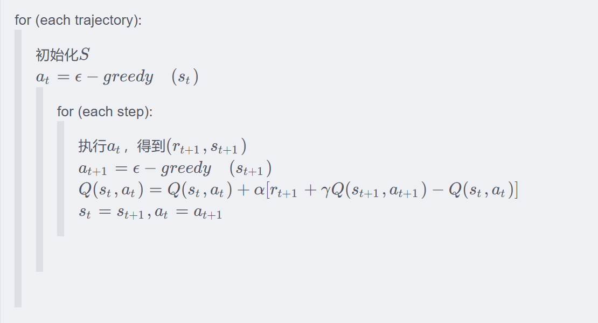

# 摘要

本文介绍了强化学习的思想和适应性从弱到强的几种强化学习算法，包括Sarsa、QLearning、DQN、DDPG。并利用这些算法在OpenAI的gym实验室中解决了实际的问题，可以帮助小白入门强化学习。

# 强化学习思想

## 相关概念


**智能体（Agent）**：智能体是与环境交互的主体，通过观察环境状态、采取动作并根据奖励信号学习策略。

**环境（Environment）**：智能体所处的外部世界，它根据智能体的动作提供新的状态和奖励。

**状态(State)/观察值(Observation)**：环境的一个描述，包含智能体当前所处的所有信息。可以是观测到的部分状态（部分可观测环境）或完整状态。

**动作（Action）**：智能体在某一状态下可以执行的行为，影响环境的转变。动作空间可以是**离散的**或**连续的**。例如，走迷宫机器人如果只有东南西北这 4 种移动方式，则其为离散动作空间;如果机器人向 360◦ 中的任意角度都可以移动，则为连续动作空间。

**奖励（Reward）**：智能体每执行一个动作后，环境反馈的数值信号，用来表示该动作的好坏。奖励可以是**即时奖励**或**累积奖励**。

**策略（Policy）**：定义智能体在某一状态下选择动作的行为规则。策略可以是：

- **随机策略（Stochastic Policy）**：输出动作的概率分布。
- **确定性策略（Deterministic Policy）**：直接输出具体动作。

**价值函数（Value Function）**：描述一个状态或状态-动作对的好坏，衡量长期回报的期望值。

- **状态价值函数 V(s)**：用来度量给定策略π的情况下，当前状态st的好坏程度。

- **动作价值函数 Q(s,a)**：用来度量给定状态$s_t$和策略$π$的情况下，采用动作$a_t$的好坏程度。

**折扣因子（Discount Factor）**：衡量未来奖励的重要性，取值范围 $0 \leq \gamma \leq 1$。较低的 $\gamma$ 更关注短期奖励，较高的 $\gamma$ 更关注长期奖励。

## 思想

强化学习（Reinforcement learning，RL）讨论的问题是一个**智能体(agent)** 怎么在一个复杂不确定的 **环境(environment)** 里面去极大化它能获得的奖励。通过感知所处环境的 **状态(state)** 对 **动作(action)** 的 **反应(reward)**， 来指导更好的动作，从而获得最大的 **收益(return)**，这被称为在交互中学习，这样的学习方法就被称作强化学习


在强化学习过程中，智能体跟环境一直在交互。智能体在环境里面获取到状态，智能体会利用这个状态输出一个动作，一个决策。然后这个决策会放到环境之中去，环境会根据智能体采取的决策，输出下一个状态以及当前的这个决策得到的奖励。智能体的目的就是为了尽可能多地从环境中获取奖励。

强化学习是除了监督学习和非监督学习之外的第三种基本的机器学习方法。

- **监督学习** 是从外部监督者提供的带标注训练集中进行学习。 **(任务驱动型)**
- **非监督学习** 是一个典型的寻找未标注数据中隐含结构的过程。 **(数据驱动型)**
- **强化学习** 更偏重于智能体与环境的交互， 这带来了一个独有的挑战 ——“**试错（exploration）**”与“**开发（exploitation）**”之间的折中权衡，智能体必须开发已有的经验来获取收益，同时也要进行试探，使得未来可以获得更好的动作选择空间。 **(从错误中学习)**

强化学习主要有以下几个特点：

- **试错学习**：强化学习一般没有直接的指导信息，Agent 要以不断与 Environment 进行交互，通过试错的方式来获得最佳策略(Policy)。
- **延迟回报**：强化学习的指导信息很少，而且往往是在事后（最后一个状态(State)）才给出的。比如 围棋中只有到了最后才能知道胜负。

**按照学习目标划分：基于策略（Policy-Based）和基于价值（Value-Based）。**


- **Policy-Based**的方法直接输出下一步动作的概率，根据概率来选取动作。但不一定概率最高就会选择该动作，还是会从整体进行考虑。适用于非连续和连续的动作。常见的方法有Policy gradients。
- **Value-Based**的方法输出的是动作的价值，选择价值最高的动作。适用于非连续的动作。常见的方法有Q-learning、Deep Q Network和Sarsa。
- 更为厉害的方法是二者的结合：Actor-Critic，Actor根据概率做出动作，Critic根据动作给出价值，从而加速学习过程，常见的有A2C，A3C，DDPG等。

# 经典算法

## Sarsa (悬崖问题)



### 示例代码

```python
import numpy as np
import gym
import time

class SarsaAgent:
    def __init__(self, obs_n, act_n, learning_rate=0.01, gamma=0.9, e_greed=0.1):
        self.act_n = act_n
        self.lr = learning_rate
        self.gamma = gamma
        self.epsilon = e_greed
        self.Q = np.zeros((obs_n, act_n))
    # e_greed:根据s_t,选择a_t
    def sample(self,obs):
        if np.random.uniform(0,1) < (1.0 - self.epsilon):
            action = self.predict(obs)
        else:
            action = np.random.choice(self.act_n) # 0,1,2,3
        return action
    # a_t = argmax Q(s)
    def predict(self, obs):
        Q_list = self.Q[obs, :] #当前s下所有a对应的Q值
        maxQ = np.max(Q_list)
        action_list = np.where(Q_list == maxQ)[0] # action_list=所有=Qmax的索引
        action = np.random.choice(action_list)
        return action
    
    def learn(self, obs, action, reward, next_obs, next_action, done): # (S,A,R,S,A)
        '''
        done: episode是否结束
        '''
        predict_Q = self.Q[obs,action]
        if done:
            target_Q = reward
        else:
            target_Q = reward + self.gamma * self.Q[next_obs,next_action]
        # 更新Q表格
        self.Q[obs,action] += self.lr * (target_Q - predict_Q)
    def save(self):
        npy_file = './q-table.npy'
        np.save(npy_file, self.Q)
        print(npy_file + ' saved.')
    def load(self, npy_file='./q_table.npy'):
        self.Q = np.load(npy_file)
        print(npy_file + ' loaded.')

def run_episode(env, agent, render=False):
    total_steps = 0 # 记录当前episode走了多少step
    total_reward = 0 
    obs = env.reset()
    action = agent.sample(obs)
    while True:
        next_obs, reward, done, _ = env.step(action)
        next_action = agent.sample(next_obs)
        agent.learn(obs, action, reward, next_obs, next_action, done)
        action = next_action
        obs = next_obs
        total_reward += reward
        total_steps += 1
        if render:
            env.render()
            time.sleep(0.)
        if done:
            break
    return total_reward, total_steps

def test_episode(env, agent): 
    total_steps = 0 # 记录当前episode走了多少step
    total_reward = 0 
    obs = env.reset()
    while True:
        action = agent.predict(obs)
        next_obs, reward, done, _ = env.step(action)
        total_reward += reward
        total_steps += 1
        obs = next_obs
        time.sleep(0.5)
        env.render()
        if done:
            break
    return total_reward, total_steps

def main():
    env = gym.make("CliffWalking-v0")
    agent = SarsaAgent(obs_n=env.observation_space.n, 
                       act_n=env.action_space.n,
                       learning_rate=0.025, gamma=0.9, e_greed=0.1)
    for episode in range(1000):
        total_reward, total_steps = run_episode(env, agent, False)
        print('Episode %s: total_steps = %s , total_reward = %.1f' % (episode, total_steps, total_reward))
    test_episode(env, agent)

main()
```


## Q-Learning

在Q-learning中，我们维护一张Q值表，表的维数为：状态数S * 动作数A，表中每个数代表在当前状态S下可以采用动作A可以获得的未来收益的折现和。我们不断的迭代我们的Q值表使其最终收敛，然后根据Q值表我们就可以在每个状态下选取一个最优策略。


假设机器人必须越过迷宫并到达终点。有地雷，机器人一次只能移动一个地砖。如果机器人踏上矿井，机器人就死了。机器人必须在尽可能短的时间内到达终点。 得分/奖励系统如下：

- 机器人在每一步都失去1点。这样做是为了使机器人采用[最短路径](https://zhida.zhihu.com/search?content_id=191787601&content_type=Article&match_order=1&q=最短路径&zhida_source=entity)并尽可能快地到达目标。
- 如果机器人踩到地雷，则点损失为100并且游戏结束。
- 如果机器人获得动力⚡️，它会获得1点。
- 如果机器人达到最终目标，则机器人获得100分。 现在，显而易见的问题是：我们如何训练机器人以最短的路径到达最终目标而不踩矿井？

### **Q值表**

Q值表(Q-Table)是一个简单查找表的名称，我们计算每个状态的最大预期未来奖励。基本上，这张表将指导我们在每个状态采取最佳行动。


### **Q函数**

Q函数(Q-Function)即为上文提到的动作价值函数，他有两个输入：「状态」和「动作」。它将返回在该状态下执行该动作的未来奖励期望。


我们可以把Q函数视为一个在Q-Table上滚动的读取器，用于寻找与当前状态关联的行以及与动作关联的列。它会从相匹配的单元格中返回 Q 值。这就是未来奖励的期望。


在我们探索环境（environment）之前，[Q-table](https://zhida.zhihu.com/search?content_id=191787601&content_type=Article&match_order=1&q=Q-table&zhida_source=entity) 会给出相同的任意的设定值（大多数情况下是 0）。随着对环境的持续探索，这个 Q-table 会通过迭代地使用 Bellman 方程（[动态规划方程](https://zhida.zhihu.com/search?content_id=191787601&content_type=Article&match_order=1&q=动态规划方程&zhida_source=entity)）更新 Q(s，a) 来给出越来越好的近似。

### **算法流程**


**第1步：初始化Q值表** 我们将首先构建一个Q值表。有n列，其中n=操作数。有m行，其中m=状态数。我们将值初始化为0


**步骤2和3：选择并执行操作** 这些步骤的组合在不确定的时间内完成。这意味着此步骤一直运行，直到我们停止训练，或者训练循环停止。


如果每个Q值都等于零，我们就需要权衡探索/利用（exploration/exploitation）的程度了，思路就是，在一开始，我们将使用 [epsilon](https://zhida.zhihu.com/search?content_id=191787601&content_type=Article&match_order=1&q=epsilon&zhida_source=entity) 贪婪策略：

- 我们指定一个探索速率「epsilon」，一开始将它设定为 1。这个就是我们将随机采用的步长。在一开始，这个速率应该处于最大值，因为我们不知道 Q-table 中任何的值。这意味着，我们需要通过随机选择动作进行大量的探索。
- 生成一个随机数。如果这个数大于 epsilon，那么我们将会进行「利用」（这意味着我们在每一步利用已经知道的信息选择动作）。否则，我们将继续进行探索。
- 在刚开始训练 Q 函数时，我们必须有一个大的 epsilon。随着智能体对估算出的 Q 值更有把握，我们将逐渐减小 epsilon。


**步骤4和5：评估** 现在我们采取了行动并观察了结果和奖励。我们需要更新功能Q（s，a）：


最后生成的Q表：


### 示例代码

```python
import numpy as np
import gym
import time

class QLearningAgent:
    def __init__(self, obs_n, act_n, learning_rate=1e-2, gamma=0.9, e_greed=0.1):
        self.act_n = act_n  # 动作维度，有几个动作可选
        self.lr = learning_rate  # 学习率
        self.gamma = gamma  # reward的衰减率
        self.epsilon = e_greed  # 按一定概率随机选动作
        self.Q = np.zeros((obs_n, act_n))
    def sample(self, obs):
        if np.random.uniform(0, 1) < (1.0 - self.epsilon):  # 根据table的Q值选动作
            action = self.predict(obs)
        else:
            action = np.random.choice(self.act_n)  # 有一定概率随机探索选取一个动作
        return action
    # 根据输入观察值，预测输出的动作值
    def predict(self, obs):
        Q_list = self.Q[obs, :]
        maxQ = np.max(Q_list)
        action_list = np.where(Q_list == maxQ)[0]  # maxQ可能对应多个action
        action = np.random.choice(action_list)
        return action
    def learn(self, obs, action, reward, next_obs, done): #(S,A,R,S)
        predict_Q = self.Q[obs, action]
        if done:
            target_Q = reward
        else:
            target_Q = reward + self.gamma * np.max(self.Q[next_obs,:])
        self.Q[obs, action] += self.lr * (target_Q - predict_Q)
    def save(self):
        npy_file = './q-table.npy'
        np.save(npy_file, self.Q)
        print(npy_file + ' saved.')
    def load(self, npy_file='./q_table.npy'):
        self.Q = np.load(npy_file)
        print(npy_file + ' loaded.')
    
def run_episode(env, agent, render=False):
    # 其实真正执行的策略和Sarsa是一样的，只不过学习的策略是保守的最优策略
    total_steps = 0
    total_reward = 0
    obs = env.reset()

    while True:
        action = agent.sample(obs)
        next_obs, reward, done, _ = env.step(action)
        agent.learn(obs, action, reward, next_obs, done)
        obs = next_obs

        total_reward += reward
        total_steps += 1
        if render:
            env.render()
        if done:
            break
    return total_reward, total_steps

def test_episode(env, agent):
    total_reward = 0
    obs = env.reset()
    while True:
        action = agent.predict(obs)  # greedy
        next_obs, reward, done, _ = env.step(action)
        total_reward += reward
        obs = next_obs
        time.sleep(0.5)
        env.render()
        if done:
            break
    return total_reward

def main():
    env = gym.make("CliffWalking-v0")  # 0 up, 1 right, 2 down, 3 left

    # 创建一个agent实例，输入超参数
    agent = QLearningAgent(
        obs_n=env.observation_space.n,
        act_n=env.action_space.n,
        learning_rate=0.1,
        gamma=0.9,
        e_greed=0.1)

    # 训练500个episode，打印每个episode的分数
    for episode in range(500):
        ep_reward, ep_steps = run_episode(env, agent, False)
        print('Episode %s: steps = %s , reward = %.1f' % (episode, ep_steps, ep_reward))

    # 全部训练结束，查看算法效果
    test_reward = test_episode(env, agent)
    print('test reward = %.1f' % (test_reward))

main()


```


## **Deep Q Network**

在普通的Q-learning中，当状态和动作空间是离散且维数不高时可使用[Q-Table](https://zhida.zhihu.com/search?content_id=191787601&content_type=Article&match_order=3&q=Q-Table&zhida_source=entity)储存每个状态动作对的Q值，而当状态和动作空间是高维连续时，使用Q-Table不现实，我们无法构建可以存储超大[状态空间](https://zhida.zhihu.com/search?content_id=191787601&content_type=Article&match_order=1&q=状态空间&zhida_source=entity)的Q_table。不过，在机器学习中， 有一种方法对这种事情很在行，那就是神经网络，可以将状态和动作当成神经网络的输入，然后经过神经网络分析后得到动作的 Q 值，这样就没必要在表格中记录 Q 值，而是直接使用神经网络预测Q值


### **经验回放**

DQN利用Qlearning特点，目标策略与动作策略分离，学习时利用经验池储存的经验取batch更新Q。同时提高了样本的利用率，也打乱了样本状态相关性使其符合神经网络的使用特点。

### **固定Q目标**

神经网络一般学习的是固定的目标，而Qlearning中Q同样为学习的变化量，变动太大不利于学习。所以DQN使Q在一段时间内保持不变，使神经网络更易于学习。

### **算法流程**


### **主要问题**

- 在估计值函数的时候一个任意小的变化可能导致对应动作被选择或者不被选择，这种不连续的变化是致使基于值函数的方法无法得到收敛保证的重要因素。
- 选择最大的Q值这样一个搜索过程在高纬度或者连续空间是非常困难的；
- 无法学习到[随机策略](https://zhida.zhihu.com/search?content_id=191787601&content_type=Article&match_order=1&q=随机策略&zhida_source=entity)，有些情况下随机策略往往是最优策略。

### 示例代码

```python
import gym
import cv2
import torch
import numpy as np
import torch.nn as nn
import pandas as pd
from torch.nn import Linear, Conv2d, ReLU
import PIL.Image as Image

device=torch.device("cuda:0" if torch.cuda.is_available() else"cpu")

# 经验池
class DQBReplayer:
    def __init__(self, capacity):
        # (S,A,R,S)
        self.memory = pd.DataFrame(index=range(capacity), columns=['observation', 'action', 'reward', 'next_observation', 'done'])
        self.i = 0
        self.count = 0
        self.capacity = capacity
    def store(self,*args):
        self.memory.loc[self.i] = args
        self.i = (self.i + 1)%self.capacity
        self.count = min(self.count+1, self.capacity)
    def sample(self, size):
        indics = np.random.choice(self.count, size=size)
        return (np.stack(self.memory.loc[indics,field]) for field in self.memory.columns)

# Q-Network
class DQN_net(nn.Module):
    def __init__(self):
        super(DQN_net, self).__init__()
        self.conv = nn.Sequential(
            Conv2d(in_channels=4, out_channels=32, kernel_size=8, stride=4),
            ReLU(),
            Conv2d(in_channels=32, out_channels=64, kernel_size=4, stride=2),
            ReLU(),
            Conv2d(in_channels=64, out_channels=64, kernel_size=3, stride=1),
            ReLU()
        )
        self.classifier = nn.Sequential(
            Linear(3136, 512),
            ReLU(),
            Linear(512, 4)
        )
    def forward(self, x):
        x = self.conv(x)
        x = x.view(x.size(0),-1)
        output = self.classifier(x)
        return output
    
class DQN(nn.Module):
    def __init__(self, input_shape, env):
        super(DQN, self).__init__()
        self.replayer_start_size = 100000
        self.upon_times = 20
        self.replayer = DQBReplayer(capacity=self.replayer_start_size)
        self.action_n = env.action_space.n
        self.image_stack = input_shape[2]
        self.gamma = 0.99
        self.image_shape = (input_shape[0], input_shape[1])
        self.e_net = DQN_net()
        self.t_net = DQN_net()

        self.learn_step = 0
        self.max_learn_step = 650000
        self.epsilon = 1.
        self.start_learn = False
    def get_next_state(self,state=None,observation=None):
        img=Image.fromarray(observation,"RGB")
        img=img.resize(self.image_shape).convert('L')
        img=np.asarray(img.getdata(),dtype=np.uint8,).reshape(img.size[1],img.size[0])
        if state is None:
            next_state = np.array([img,]*self.image_stack)
        else:
            next_state = np.append(state[1:],[img,],axis=0)
        return next_state
    def decide(self,state,step):
        if self.start_learn == False: #前50000步随机选择
            action = np.random.randint(0, 4)
            return action
        else:
            self.epsilon -= 0.0000053
        if step < 30:
            #每局前三十步随机选择，中间30万，
            #以一定概率（1-epsilon）通过神经网络选择，
            # 最后30万次以0.99概率通过神经网络选择
            action = np.random.randint(0, 4)
        elif np.random.random() < max(self.epsilon, 0.0005):
            action = np.random.randint(0,4)
        else:
            state = state/128 - 1
            y = torch.Tensor(state).float().unsqueeze(0)
            y = y.to(device)
            x = self.e_net(y).detach()
            if self.learn_step%2000==0:
                print("q value{}".format(x))
            action = torch.argmax(x).data.item()
        return action
    
def main():
    sum_reward = 0
    store_count = 0
    env = gym.make('Breakout-v0')
    net = DQN([84,84,4], env).cuda()
    
    Load_Net = 0
    if Load_Net==1:
        load_net_path = './epsiode_2575_reward_10.0.pkl'
        print("Load old net and the path is:",load_net_path)
        net.e_net = torch.load(load_net_path)
        net.t_net = torch.load(load_net_path)
    max_score = 0
    mse = nn.MSELoss()
    mse = mse.cuda()
    opt = torch.optim.RMSprop(net.e_net.parameters(), lr=0.0015)
    for i in range(20000):
        lives = 5
        obs = env.reset()
        state = net.get_next_state(None,obs)
        epoch_reward = 0
        if i%100==0:
            print("{} times_game".format(i),end=':')
            print('epoch_reward:{}'.format(epoch_reward))
        for step in range(500000):
            action = net.decide(state,step=step)
            obs, reward, done, _ = env.step(action)
            next_state = net.get_next_state(state, obs) 
            epoch_reward += reward
            net.replayer.store(state, action, reward, next_state, done)
            net.learn_step += 1
            if net.learn_step >= net.replayer_start_size // 2 and net.learn_step % 4 == 0:
                if net.start_learn == False:
                    net.start_learn = True
                    print('Start Learn!')
                sample_n = 32
                states, actions, rewards, next_states, dones = net.replayer.sample(sample_n)
                states, next_states = states / 128 -1, next_states / 128 -1
                rewards = torch.Tensor(np.clip(rewards,-1,1)).unsqueeze(1).cuda()
                states, next_states = torch.Tensor(states).cuda(), torch.Tensor(next_states).cuda()
                actions = torch.Tensor(actions).long().unsqueeze(1).cuda()
                dones = torch.Tensor(dones).unsqueeze(1).cuda()
                q = net.e_net(states).gather(1, actions)
                q_next = net.t_net(next_states).detach().max(1)[0].reshape(sample_n, 1)
                tq = rewards + net.gamma * (1-done) * q_next
                loss = mse(q, tq)
                opt.zero_grad()
                loss.backward()
                opt.step()
                if net.learn_step % (net.upon_times * 5) == 0:
                    net.t_net.load_state_dict(net.e_net.state_dict())
                if net.learn_step % 100 == 0:
                    loss_record = loss.item()
                    a_r = torch.mean(rewards, 0).item()
                
            state = next_state
            
            if done:
                save_net_path = './'
                sum_reward+=epoch_reward
                if epoch_reward > max_score:
                    name = "epsiode_" + str(net.learn_step) + "_reward_" + str(epoch_reward) + ".pkl"
                    torch.save(net.e_net, save_net_path+name)
                    max_score = epoch_reward
                elif i % 1000 == 0:
                    name ="No."+str(i)+".pkl"
                    torch.save(net.e_net, save_net_path + name)
                if i%10==0:
                    sum_reward=0
                break
               
import cv2

def PictureArray2Video(pic_list, path='./test.mp4'):
    h,w,_ = pic_list[0].shape[0], pic_list[0].shape[1], pic_list[0].shape[2]
    print(h,w)
    writer = cv2.VideoWriter(path, cv2.VideoWriter_fourcc('m', 'p', '4', 'v'), 10, (w, h), True)
    total_frame = len(pic_list)
    for i in range(total_frame):
        writer.write(pic_list[i])
    writer.release()
    
def test():
    pics = []
    sum_reward = 0
    store_count = 0
    env = gym.make('Breakout-v0')
    net = DQN([84,84,4], env).cuda()
    
    Load_Net = 1
    if Load_Net==1:
        load_net_path = './epsiode_10219_reward_9.0.pkl'
        print("Load old net and the path is:",load_net_path)
        net.e_net = torch.load(load_net_path)
        net.t_net = torch.load(load_net_path)
    max_score = 0
    mse = nn.MSELoss()
    mse = mse.cuda()
    

    obs = env.reset()
    state = net.get_next_state(None,obs)
    epoch_reward = 0
    
    for step in range(500000):
        action = net.decide(state,step=step)
        obs, reward, done, _ = env.step(action)
        pic = env.render(mode='rgb_array')
        pic = cv2.cvtColor(pic,cv2.COLOR_BGR2RGB)
        next_state = net.get_next_state(state, obs) 
        pics.append(pic)
        if done:
            PictureArray2Video(pics)
            break   

```


## **Policy Gradient**

前面我们介绍的Q-Learning和DQN都是基于价值的强化学习算法，在给定一个状态下，计算采取每个动作的价值，我们选择有[最高Q值](https://zhida.zhihu.com/search?content_id=191787601&content_type=Article&match_order=1&q=最高Q值&zhida_source=entity)（在所有状态下最大的期望奖励）的行动。如果我们省略中间的步骤，即直接根据当前的状态来选择动作，也就引出了强化学习中的另一种很重要的算法，即策略梯度(Policy Gradient， PG)

策略梯度不通过误差反向传播，它通过观测信息选出一个行为直接进行[反向传播](https://zhida.zhihu.com/search?content_id=191787601&content_type=Article&match_order=2&q=反向传播&zhida_source=entity)，当然出人意料的是他并没有误差，而是利用reward奖励直接对选择行为的可能性进行增强和减弱，好的行为会被增加下一次被选中的概率，不好的行为会被减弱下次被选中的概率。

举例如下图所示：输入当前的状态，输出action的概率分布，选择概率最大的一个action作为要执行的操作。


### **优缺点**

**优点**

- 连续的动作空间（或者高维空间）中更加高效；
- 可以实现随机化的策略；
- 某种情况下，价值函数可能比较难以计算，而策略函数较容易。

**缺点**

- 通常收敛到[局部最优](https://zhida.zhihu.com/search?content_id=191787601&content_type=Article&match_order=1&q=局部最优&zhida_source=entity)而非全局最优
- 评估一个策略通常低效（这个过程可能慢，但是具有更高的可变性，其中也会出现很多并不有效的尝试，而且[方差](https://zhida.zhihu.com/search?content_id=191787601&content_type=Article&match_order=1&q=方差&zhida_source=entity)高）

### **REINFORCE**

[蒙特卡罗策略梯度](https://zhida.zhihu.com/search?content_id=191787601&content_type=Article&match_order=1&q=蒙特卡罗策略梯度&zhida_source=entity)reinforce算法是策略梯度最简单的也是最经典的一个算法。


### **算法流程**


首先我们需要一个 policy model 来输出动作概率，输出动作概率后，我们 sample() 函数去得到一个具体的动作，然后跟环境交互过后，我们可以得到一整个回合的数据。拿到回合数据之后，我再去执行一下 learn() 函数，在 learn() 函数里面，我就可以拿这些数据去构造[损失函数](https://zhida.zhihu.com/search?content_id=191787601&content_type=Article&match_order=1&q=损失函数&zhida_source=entity)，扔给这个优化器去优化，去更新我的 policy model。

### 示例代码

```python
import torch
import gym
import numpy as np
import torch.nn as nn
from torch.nn import Linear
import torch.nn.functional as F
import torch.optim as optim
from torch.distributions import Categorical
import time

lr = 0.002
gamma = 0.8

class PGPolicy(nn.Module):
    def __init__(self, input_size=4, hidden_size=128, output_size=2):
        super(PGPolicy, self).__init__()
        self.fc1 = Linear(input_size, hidden_size)
        self.fc2 = Linear(hidden_size, output_size)
        self.dropout = nn.Dropout(p=0.6)
        
        self.saved_log_probs = []# 记录每一步的动作概率
        self.rewards = []#记录每一步的r
    def forward(self, x):
        x = self.fc1(x)
        x = self.dropout(x)
        x = F.relu(x)
        x = self.fc2(x)
        out = F.softmax(x, dim=1)
        return out

def choose_action(state, policy):
    state = torch.from_numpy(state).float().unsqueeze(0) # 在索引0对应位置增加一个维度
    probs = policy(state) 
    m = Categorical(probs) #创建以参数probs为标准的类别分布,之后的m.sampe就会按此概率选择动作
    action = m.sample()
    policy.saved_log_probs.append(m.log_prob(action))
    return action.item()#返回的就是int

def learn(policy, optimizer):
    R = 0
    policy_loss = []
    returns = []
    for r in policy.rewards[::-1]:
        R = r + gamma*R
        returns.insert(0,R)#从头部插入，即反着插入
    returns = torch.tensor(returns)
    # 归一化（均值方差），eps是一个非常小的数，避免除数为0
    eps = np.finfo(np.float64).eps.item()
    returns = (returns - returns.mean()) / (returns.std() + eps)  
    for log_prob, R in zip(policy.saved_log_probs, returns):
        policy_loss.append(-log_prob*R)

    optimizer.zero_grad()
    policy_loss = torch.cat(policy_loss).sum()
    policy_loss.backward()
    optimizer.step()

    del policy.rewards[:]  # 清空数据
    del policy.saved_log_probs[:]

def train(episode_num):
    env = gym.make('CartPole-v1')
    env.seed(1)
    torch.manual_seed(1)
    policy = PGPolicy()
    # policy.load_state_dict(torch.load('save_model.pt'))  # 模型导入
    optimizer = optim.Adam(policy.parameters(), lr)
    average_r = 0

    for i in range(1, episode_num+1): #采这么多轨迹
        obs = env.reset()
        ep_r = 0
        for t in range(1, 10000):
            action = choose_action(obs, policy)
            obs, reward, done, _ = env.step(action)
            policy.rewards.append(reward)
            ep_r += reward
            if done:
                break
        average_r = 0.05 * ep_r + (1-0.05) * average_r
        learn(policy, optimizer)
        if i % 10 == 0:
                print('Episode {}\tLast reward: {:.2f}\tAverage reward: {:.2f}'.format(i, ep_r, average_r))

    torch.save(policy.state_dict(), 'PGPolicy.pt')
def test():
    env = gym.make('CartPole-v1')
    env.seed(1)
    torch.manual_seed(1)
    policy = PGPolicy()
    policy.load_state_dict(torch.load('PGPolicy.pt'))  # 模型导入
    average_r = 0
    with torch.no_grad():
        obs = env.reset()
        ep_r = 0
        for t in range(1, 10000):
            action = choose_action(obs, policy)
            obs, reward, done, _ = env.step(action)
            policy.rewards.append(reward)
            env.render()
            time.sleep(0.1)
            ep_r += reward
            if done:
                break

train(1000)

#  test()

```


## **Actor Critic**

[演员-评论家算法](https://zhida.zhihu.com/search?content_id=191787601&content_type=Article&match_order=1&q=演员-评论家算法&zhida_source=entity)(Actor-Critic)是基于策略(Policy Based)和基于价值(Value Based)相结合的方法


- 演员(Actor)是指[策略函数](https://zhida.zhihu.com/search?content_id=191787601&content_type=Article&match_order=2&q=策略函数&zhida_source=entity)πθ(a|s)，即学习一个策略来得到尽量高的回报。
- 评论家(Critic)是指值函数 Vπ(s)，对当前策略的值函数进行估计，即评估演员的好坏。
- 借助于价值函数，演员-评论家算法可以进行单步更新参数，不需要等到回合结束才进行更新。

### **网络结构**

整体结构：


Actor和Critic的网络结构：


### **算法流程**


### **问题和改进**

Actor Critic 取决于 Critic 的价值判断， 但是 Critic 难收敛， 再加上 Actor 的更新， 就更难收敛，为了解决该问题又提出了 A3C 算法和 DDPG 算法。

**改进算法1：A3C** 异步的优势[行动者评论家算法](https://zhida.zhihu.com/search?content_id=191787601&content_type=Article&match_order=1&q=行动者评论家算法&zhida_source=entity)（Asynchronous Advantage Actor-Critic，A3C），相比Actor-Critic，A3C的优化主要有3点，分别是异步训练框架，网络结构优化，Critic评估点的优化。其中异步训练框架是最大的优化。


**改进算法2：DDPG** 深度确定性策略梯度(Deep Deterministic Policy Gradient，DDPG)，从DDPG这个名字看，它是由D（Deep）+D（Deterministic ）+ PG(Policy Gradient)组成。

- Deep 是因为用了神经网络；
- Deterministic 表示 DDPG 输出的是一个确定性的动作，可以用于连续动作的一个环境；
- Policy Gradient 代表的是它用到的是[策略网络](https://zhida.zhihu.com/search?content_id=191787601&content_type=Article&match_order=1&q=策略网络&zhida_source=entity)。REINFORCE 算法每隔一个 episode 就更新一次，但 DDPG 网络是每个 step 都会更新一次 policy 网络，也就是说它是一个单步更新的 policy 网络。


### 示例代码

```python
import torch
import torch.nn as nn
import torch.nn.functional as F
import numpy as np
import gym
import time

#####################  hyper parameters  ####################
EPISODES = 200
EP_STEPS = 200
LR_ACTOR = 0.001
LR_CRITIC = 0.002
GAMMA = 0.9
TAU = 0.01
MEMORY_CAPACITY = 10000
BATCH_SIZE = 32
RENDER = False
ENV_NAME = 'Pendulum-v1'

########################## DDPG Framework ######################
class ActorNet(nn.Module): # define the network structure for actor and critic
    def __init__(self, s_dim, a_dim):
        super(ActorNet, self).__init__()
        self.fc1 = nn.Linear(s_dim, 30)
        self.fc1.weight.data.normal_(0, 0.1) # initialization of FC1
        self.out = nn.Linear(30, a_dim)
        self.out.weight.data.normal_(0, 0.1) # initilizaiton of OUT
    def forward(self, x):
        x = self.fc1(x)
        x = F.relu(x)
        x = self.out(x)
        x = torch.tanh(x)
        actions = x * 2 # for the game "Pendulum-v0", action range is [-2, 2]
        return actions

class CriticNet(nn.Module):
    def __init__(self, s_dim, a_dim):
        super(CriticNet, self).__init__()
        self.fcs = nn.Linear(s_dim, 30)
        self.fcs.weight.data.normal_(0, 0.1)
        self.fca = nn.Linear(a_dim, 30)
        self.fca.weight.data.normal_(0, 0.1)
        self.out = nn.Linear(30, 1)
        self.out.weight.data.normal_(0, 0.1)
    def forward(self, s, a):
        x = self.fcs(s)
        y = self.fca(a)
        actions_value = self.out(F.relu(x+y))
        return actions_value
    
class DDPG(object):
    def __init__(self, a_dim, s_dim, a_bound):
        self.a_dim, self.s_dim, self.a_bound = a_dim, s_dim, a_bound
        self.memory = np.zeros((MEMORY_CAPACITY, s_dim * 2 + a_dim + 1), dtype=np.float32)
        self.pointer = 0 # serves as updating the memory data 
        # Create the 4 network objects
        self.actor_eval = ActorNet(s_dim, a_dim)
        self.actor_target = ActorNet(s_dim, a_dim)
        self.critic_eval = CriticNet(s_dim, a_dim)
        self.critic_target = CriticNet(s_dim, a_dim)
        # create 2 optimizers for actor and critic
        self.actor_optimizer = torch.optim.Adam(self.actor_eval.parameters(), lr=LR_ACTOR)
        self.critic_optimizer = torch.optim.Adam(self.critic_eval.parameters(), lr=LR_CRITIC)
        # Define the loss function for critic network update
        self.loss_func = nn.MSELoss()
    def store_transition(self, s, a, r, s_): # how to store the episodic data to buffer
        transition = np.hstack((s, a, [r], s_))
        index = self.pointer % MEMORY_CAPACITY # replace the old data with new data 
        self.memory[index, :] = transition
        self.pointer += 1
    
    def choose_action(self, s):
        # print(s)
        s = torch.unsqueeze(torch.FloatTensor(s), 0)
        return self.actor_eval(s)[0].detach()
    
    def learn(self):
        # softly update the target networks
        for x in self.actor_target.state_dict().keys():
            eval('self.actor_target.' + x + '.data.mul_((1-TAU))')
            eval('self.actor_target.' + x + '.data.add_(TAU*self.actor_eval.' + x + '.data)')
        for x in self.critic_target.state_dict().keys():
            eval('self.critic_target.' + x + '.data.mul_((1-TAU))')
            eval('self.critic_target.' + x + '.data.add_(TAU*self.critic_eval.' + x + '.data)')           
        # sample from buffer a mini-batch data
        indices = np.random.choice(MEMORY_CAPACITY, size=BATCH_SIZE)
        batch_trans = self.memory[indices, :]
        # extract data from mini-batch of transitions including s, a, r, s_
        batch_s = torch.FloatTensor(batch_trans[:, :self.s_dim])
        batch_a = torch.FloatTensor(batch_trans[:, self.s_dim:self.s_dim + self.a_dim])
        batch_r = torch.FloatTensor(batch_trans[:, -self.s_dim - 1: -self.s_dim])
        batch_s_ = torch.FloatTensor(batch_trans[:, -self.s_dim:])
        # make action and evaluate its action values
        a = self.actor_eval(batch_s)
        q = self.critic_eval(batch_s, a)
        actor_loss = -torch.mean(q)
        # optimize the loss of actor network
        self.actor_optimizer.zero_grad()
        actor_loss.backward()
        self.actor_optimizer.step()
        
        # compute the target Q value using the information of next state
        a_target = self.actor_target(batch_s_)
        q_tmp = self.critic_target(batch_s_, a_target)
        q_target = batch_r + GAMMA * q_tmp
        # compute the current q value and the loss
        q_eval = self.critic_eval(batch_s, batch_a)
        td_error = self.loss_func(q_target, q_eval)
        # optimize the loss of critic network
        self.critic_optimizer.zero_grad()
        td_error.backward()
        self.critic_optimizer.step()
        
############################### Training ######################################
# Define the env in gym
env = gym.make(ENV_NAME)
env = env.unwrapped
env.seed(1)
s_dim = env.observation_space.shape[0]
a_dim = env.action_space.shape[0]
a_bound = env.action_space.high
a_low_bound = env.action_space.low

ddpg = DDPG(a_dim, s_dim, a_bound)
var = 3 # the controller of exploration which will decay during training process
t1 = time.time()
for i in range(EPISODES):
    s = env.reset()
    ep_r = 0
    for j in range(EP_STEPS):
        if RENDER: env.render()
        # add explorative noise to action
        a = ddpg.choose_action(s)
        a = np.clip(np.random.normal(a, var), a_low_bound, a_bound)
        s_, r, done, info, _ = env.step(a)
        ddpg.store_transition(s, a, r / 10, s_) # store the transition to memory
        
        if ddpg.pointer > MEMORY_CAPACITY:
            var *= 0.9995 # decay the exploration controller factor
            ddpg.learn()
            
        s = s_
        ep_r += r
        if j == EP_STEPS - 1:
            print('Episode: ', i, ' Reward: %i' % (ep_r), 'Explore: %.2f' % var)
            if ep_r > -300 : RENDER = True
            break
print('Running time: ', time.time() - t1)
    
       
            
if __name__ == "__main__":
    learn()    
    env.close()
    


```


# 参考文献

[1].[强化学习入门：基本思想和经典算法 - 知乎](https://zhuanlan.zhihu.com/p/466455380#:~:text=强化学习（Reinforcement learning，RL）讨论的问题是一个 智能体 (agent) 怎么在一个复杂不确定的 环境 (environment) 里面去极大化它能获得的奖励。,动作 (action) 的 反应 (reward)， 来指导更好的动作，从而获得最大的 收益 (return)，这被称为在交互中学习，这样的学习方法就被称作强化学习。)

[2].[基础的强化学习(RL)算法及代码详细demo_强化学习代码-CSDN博客](https://blog.csdn.net/weixin_45696231/article/details/126723207)

